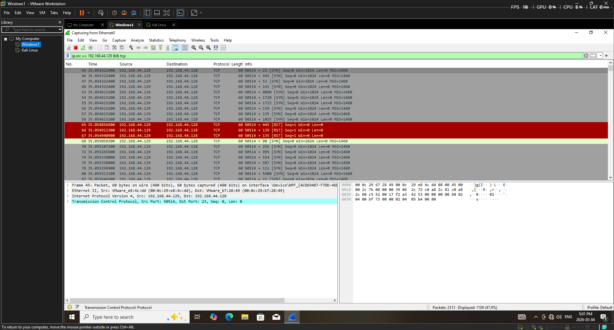

# Project 01 : Nmap Reconnaissance & Forensic Artefact Analysis

**Date:** 2026-05-02  
**Tools:** Nmap 7.98, Windows Event Viewer, auditpol  
**Environment:** Kali Linux (attacker) → Windows 10 (victim), isolated host-only network

---

## Objective
Simulate a basic network reconnaissance attack from Kali Linux against a Windows 10 target, then identify and analyse the forensic artefacts left behind in Windows Security logs.

---

## Methodology

### 1. Reconnaissance
Ran an Nmap default scan from Kali to discover open ports on the Windows target:nmap 192.168.44.128

**Findings:** 3 open ports discovered
- 135/tcp — msrpc (Microsoft RPC)
- 139/tcp — netbios-ssn
- 445/tcp — microsoft-ds (SMB)

### 2. Service version detection
nmap -sV 192.168.44.128
**Findings:** Confirmed Windows OS. SMB port 445 open and accessible.

---

## Forensic Analysis

### Enabling audit logging
Windows Filtering Platform connection logging was not enabled by default. Enabled it via: auditpol /set /subcategory:"Filtering Platform Connection" /success:enable /failure:enable
### Evidence found — Event ID 5156
After re-running the scan, Windows Security logs recorded every connection attempt with the following details:

| Field | Value |
|-------|-------|
| Event ID | 5156 |
| Source Address | 192.168.44.129 (Kali) |
| Destination Port | 445 (SMB) |
| Direction | Inbound |
| Timestamp | 2026-05-02 09:54:57 AM |
| Computer | DESKTOP-96F5GKI |

### Screenshots

**Nmap scan results - open ports discovered:**

**Event ID 5156 - forensic evidence of the scan:**

### Packet capture analysis - Wireshark

Captured live network traffic on the victim machine during the Nmap scan using Wireshark.

**Filter used:** `ip.src == 192.168.44.129 && tcp`

**Findings:**

| Packet type | Meaning |
|-------------|---------|
| SYN (grey) | Nmap probing each port - "is anyone listening?" |
| RST (red) | Windows rejecting closed ports - "nothing here" |

Ports 135, 139 and 445 did not respond with RST, confirming they are open and actively listening. This is exactly how Nmap determines a port is open without completing a full TCP handshake.

**Key forensic takeaway:** A SYN scan is stealthy because it never completes the handshake, but it is still fully visible in a packet capture. An investigator with a PCAP file can reconstruct the entire port scan and identify every port the attacker probed.

---

## Next Steps
- Attempt SMB exploitation using Metasploit
- Capture and analyse network traffic with Wireshark during the attack
- Document additional artefacts left in Windows registry and prefetch files
